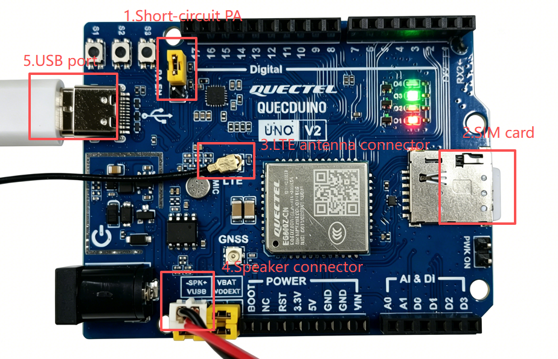

# AI Chatbot

[中文](README_zh.md)

AI Chatbot is an intelligent voice interaction and on-device tool calling solution built on UniRTOS and the Coze platform.

Based on UniRTOS as the on-device runtime, this project works with the Coze platform to complete model conversations and cloud capability access, and implements button interaction, voice conversation, model Q&A, on-device tool calling, and audio pipeline processing on the Quectel EG800Z module. The system supports initiating model conversations via both buttons and voice, and can invoke on-device tools during a conversation, such as turning the LED on/off and printing on-device logs. It also supports flexible extension: users can add their own on-device or cloud tool calls and change the audio codec. Relying on the API-rich UniRTOS, the solution adapts well across modules and runs easily on different Quectel modules, suitable for smart voice assistants, AI interaction terminals, on-device tool control, and rapid Quectel module integration.

This project highlights the capabilities of UniRTOS and the Coze platform in voice interaction, model conversation, on-device tool calling, cross-module deployment, and feature extension, and serves as a reference example for AI chatbots, smart voice terminals, and device-cloud collaborative interaction systems.

# Development Resources

| Resource                    | Quantity | Description                                                  | How to Obtain                                                |
| :-------------------------- | :------- | :----------------------------------------------------------- | :----------------------------------------------------------- |
| QuecDuino development board | 1        | Hardware platform for running the project.                   | [Buy here](https://www.quecmall.com/goods-detail/2c90800b9e4a2da8019e71fa2b3000df) |
| USB data cable              | 1        | Used to connect the PC and the development board; a USB-A to USB-C cable, not a charge-only type. | [Buy here](https://detail.tmall.com/item.htm?ali_refid=a3_430673_1006:1103572855:H:iN3MzxVVXOSPAWKJATalEI8iKmKqJtEV:eb029f7aacc91614af019d5af9cf8eb7&ali_trackid=282_eb029f7aacc91614af019d5af9cf8eb7&id=792907708735&loginBonus=1&mi_id=0000OnGii6VAwboncMLNvxgujyzZSTVWPKVNZ10CzkTIBXU&mm_sceneid=1_0_27850903_0&priceTId=213e09ef17885029529444013e11cc&skuId=6073745560170&spm=a21n57.sem.item.2&utparam={) |
| PC                          | 1        | Windows 10/Windows 11.                                       | Self-provided                                                |
| SIM card                    | 1        | A USIM card with normal data access.                         | Self-provided                                                |
| Speaker                     | 1        | A 2-5 W speaker                                              | [Buy here](https://detail.tmall.com/item.htm?ali_refid=a3_430673_1006:1303560141:H:1UEtsEX5o9gEalK6ot+dnA==:8f0dd6b837c4c9e250b45b19b048b111&ali_trackid=282_8f0dd6b837c4c9e250b45b19b048b111&id=656727733940&loginBonus=1&mi_id=0000eFuxxvI3dkbfsjA4nJlHpbZPiU3o9ksXjoYXBm6G9M8&mm_sceneid=1_0_727720075_0&priceTId=2147841b17885034262562164e1108&skuId=4801699341985&spm=a21n57.sem.item.44&utparam={) |
| LED module                  | 1        | GPIO-driven LED module                                       | [Buy here](https://detail.tmall.com/item.htm?ali_refid=a3_430673_1006:1256430174:H:pAYC57K63RlYQ4s95Zvniw==:918898e7fc3244641f0a89ea106df754&ali_trackid=282_918898e7fc3244641f0a89ea106df754&id=610156877546&loginBonus=1&mi_id=0000K58ZmWypAAYEUmAKBBDhtm2IUe2BQse3ugYmODO5XD4&mm_sceneid=1_0_666480043_0&priceTId=2147841b17885035429406683e1108&skuId=5604453201759&spm=a21n57.sem.item.85&utparam={) |
| ASRPRO                      | 1        | Optional, for voice wake-up                                  | Self-provided                                                |

# Quick Start

## Hardware Connection



1. Use jumper caps to short the PA pins on the development board.
2. Install the LTE antenna onto the antenna base of the development board.
3. Insert the SIM card into the SIM card slot.
4. Connect the speaker to the speaker interface.
5. Connect the development board to the PC with the USB data cable.
6. (Optional) Connect the ASRPRO module to UART1 with crossed UART wiring: module TX to host RX, module RX to host TX.

## Software Deployment

### Setting Up the Development Environment

Refer to [UniRTOS Quick Start](https://docs.quectel.com/zh/UniRTOS/UniRTOS文档/快速上手/快速上手.html) to install the development environment, and make sure unirtos-cli is available in PowerShell.

### Pulling the Code

Open a new PowerShell window and run the following commands:

```PowerShell
unirtos-cli new -r unirtos-maker-examples
cd unirtos-maker-examples/ai_chatbot
```

### Modifying Configuration Parameters

The project configuration is centralized in *main/inc/chatbot_config.h*.

| Category           | Item                                                         | Description                                                  |
| :----------------- | :----------------------------------------------------------- | :----------------------------------------------------------- |
| Wake-up module     | *CHATBOT_WAKE_UART_PORT, CHATBOT_WAKE_UART_BAUDRATE*         | UART port and baud rate of the ASRPRO, currently UART1 and 9600 bps. |
| Wake-up keyword    | *CHATBOT_WAKE_KEYWORD*                                       | Keyword reported by the ASRPRO for matching; the current example is "WAKE". |
| Status LED         | *CHATBOT_LED_PIN_NUM*                                        | Physical pin of the status LED, currently 55 by default.     |
| PTT button         | *CHATBOT_TALK_BUTTON_PIN_NUM, CHATBOT_TALK_BUTTON_GPIO*      | Physical pin and GPIO mapping of the button, currently pin 50 mapped to GPIO37. |
| Coze access        | *CHATBOT_COZE_BOT_ID, CHATBOT_COZE_AUTH_TOKEN*               | Configure the Bot ID and the access token respectively. The token is sensitive information; you must use your own valid token. |
| Audio codec        | *CHATBOT_AUDIO_CODEC_G711A*                                  | Set to 1 to use G711A, 8 kHz; set to 0 to use PCM16, 16 kHz. |
| Audio frame        | *CHATBOT_AUDIO_FRAME_MS*                                     | Duration of a single frame, currently 100 ms.                |
| Session parameters | *CHATBOT_SESSION_IDLE_TIMEOUT_MS, CHATBOT_RECONNECT_BACKOFF_MS* | Configure the idle timeout and the reconnection backoff respectively, currently 60 s and 5 s. |

### Building the Project

Run the following in PowerShell:

```PowerShell
unirtos-cli env-setup
unirtos-cli build -m EG800ZCN_LA
```

After a successful build, the end of the command line shows:

```Plain
SUCCESS: Unirtos project built successfully!
```

Flash the generated firmware to the development board with the QFlash tool.

### Verifying the Project

1. Press and hold the power button (S1) on the development board to power it on. Open the EPAT tool and configure it as described in this [tutorial](https://www.quectel.com.cn/unirtos/docs?docs_page=快速上手/日志调试/日志调试.html). After configuration, restart the development board and start capturing module logs from module power-on to ensure complete log output.


1. Wait for project initialization to complete, then press and hold the wake-up button (S2) to wake the Agent and establish a WebSocket connection. Once connected, the opening line delivered by the Agent will be played; it is specified as "Hello, is there anything I can help you with?" in the project source code.
2. After the opening line finishes playing, press and hold the wake-up button (S2) again to start speaking, release the button when done, and wait for the Agent's reply.