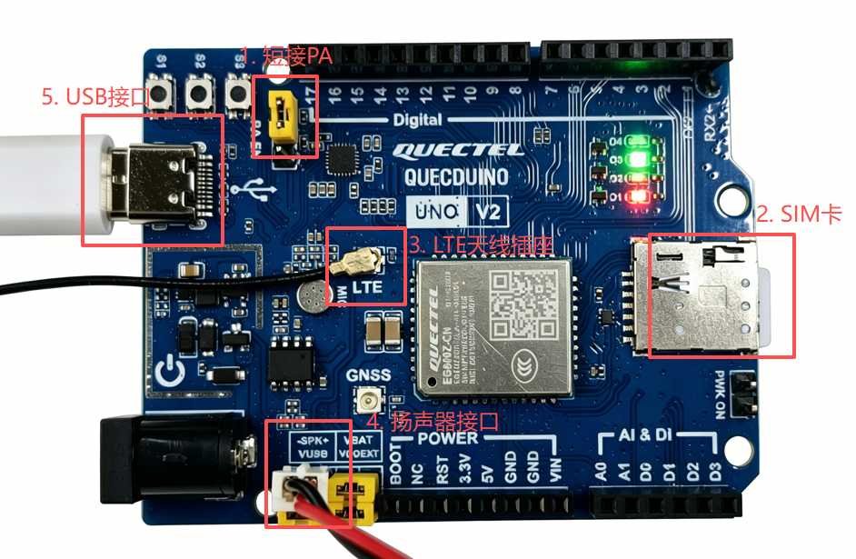
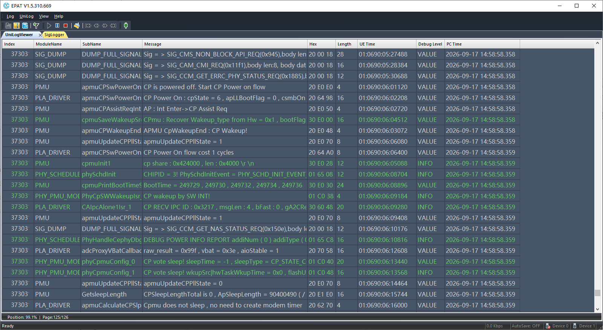
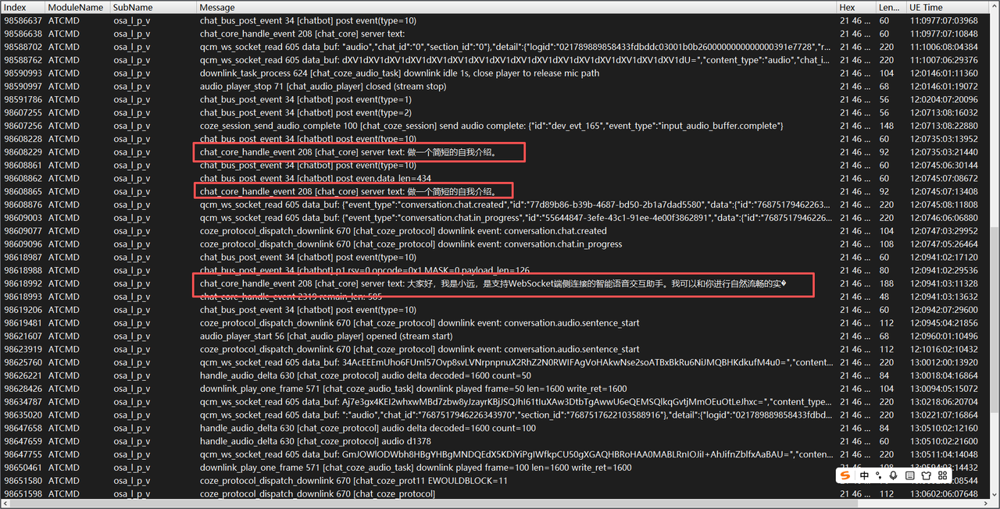

# AI聊天机器人

[English](README.md)

AI聊天机器人方案是一个基于UniRTOS与Coze平台构建的智能语音交互与端侧工具调用方案。

本项目以UniRTOS作为端侧运行基础，结合Coze平台完成模型对话与云端能力接入，在移远EG800Z模组上实现按键交互、语音对话、模型问答、端侧工具调用及音频链路处理。系统支持通过按键和语音两种方式发起模型对话，并可在对话过程中调用端侧工具，例如控制LED打开/关闭、打印端侧日志等；同时支持灵活扩展，用户可自行添加端侧或云端工具调用、更改音频编码等。依托API接口丰富的UniRTOS，方案具备良好的跨模组适配能力，便于在不同移远模组上运行，适用于智能语音助手、AI交互终端、端侧工具控制及移远模组快速集成等场景。

该项目重点展示UniRTOS与Coze平台在语音交互、模型对话、端侧工具调用、跨移远模组部署和功能扩展方面的能力，可作为AI聊天机器人、智能语音终端和端云协同交互系统的参考示例。

# 开发资源

| 资源名称        | 数量 | 简要描述                                           | 获取方法                                                     |
| :-------------- | :--- | :------------------------------------------------- | :----------------------------------------------------------- |
| QuecDuino开发板 | 1    | 项目运行硬件平台。                                 | [点此购买](https://www.quecmall.com/goods-detail/2c90800b9e4a2da8019e71fa2b3000df) |
| USB数据线       | 1    | 用于连接PC和开发板，非“仅充电”类型的USB-A转USB-C。 | [点此购买](https://detail.tmall.com/item.htm?ali_refid=a3_430673_1006%3A1103572855%3AH%3AiN3MzxVVXOSPAWKJATalEI8iKmKqJtEV%3Aeb029f7aacc91614af019d5af9cf8eb7&ali_trackid=282_eb029f7aacc91614af019d5af9cf8eb7&id=792907708735&loginBonus=1&mi_id=0000OnGii6VAwboncMLNvxgujyzZSTVWPKVNZ10CzkTIBXU&mm_sceneid=1_0_27850903_0&priceTId=213e09ef17885029529444013e11cc&skuId=6073745560170&spm=a21n57.sem.item.2&utparam={"aplus_abtest"%3A"80d921898feda47009cd32ee6352cefe"}&xxc=ad_ztc) |
| PC              | 1    | 系统为Windows 10/Windows 11。                      | 自行准备                                                     |
| SIM卡           | 1    | 可正常上网的USIM卡。                               | 自行准备                                                     |
| 喇叭            | 1    | 功率 2-5 W的喇叭                                   | [点此购买](https://detail.tmall.com/item.htm?ali_refid=a3_430673_1006%3A1303560141%3AH%3A1UEtsEX5o9gEalK6ot%2BdnA%3D%3D%3A8f0dd6b837c4c9e250b45b19b048b111&ali_trackid=282_8f0dd6b837c4c9e250b45b19b048b111&id=656727733940&loginBonus=1&mi_id=0000eFuxxvI3dkbfsjA4nJlHpbZPiU3o9ksXjoYXBm6G9M8&mm_sceneid=1_0_727720075_0&priceTId=2147841b17885034262562164e1108&skuId=4801699341985&spm=a21n57.sem.item.44&utparam={"aplus_abtest"%3A"1b6a8702424a77081a5003ca3ca2d9e9"}&xxc=ad_ztc) |
| LED模块         | 1    | GPIO驱动的LED模块                                  | [点此购买](https://detail.tmall.com/item.htm?ali_refid=a3_430673_1006%3A1256430174%3AH%3ApAYC57K63RlYQ4s95Zvniw%3D%3D%3A918898e7fc3244641f0a89ea106df754&ali_trackid=282_918898e7fc3244641f0a89ea106df754&id=610156877546&loginBonus=1&mi_id=0000K58ZmWypAAYEUmAKBBDhtm2IUe2BQse3ugYmODO5XD4&mm_sceneid=1_0_666480043_0&priceTId=2147841b17885035429406683e1108&skuId=5604453201759&spm=a21n57.sem.item.85&utparam={"aplus_abtest"%3A"52f1fc6574a371d5d0c10acc0eb02cbe"}&xxc=ad_ztc) |
| ASRPRO          | 1    | 可选，用于语音唤醒                                 | 自行准备                                                     |

# 快速上手

## 硬件连接



1. 使用跳线帽短接开发板的PA引脚。
2. 将LTE天线安装到开发板的天线底座。
3. 将SIM卡插入SIM卡卡槽。
4. 将喇叭接入扬声器接口。
5. 使用USB数据线连接开发板和PC。
6. （可选）将ASRPRO语音模块连接至UART1，UART交叉连接：模块TX接主控RX，模块RX接主控TX。

## 软件部署

### 开发环境搭建

参考[UniRTOS快速入门](https://docs.quectel.com/zh/UniRTOS/UniRTOS文档/快速上手/快速上手.html)完成开发环境安装，并确认unirtos-cli可在PowerShell中使用。

### 代码拉取

新开启PowerShell窗口，执行以下命令：

```PowerShell
unirtos-cli new -r unirtos-maker-examples
cd unirtos-maker-examples/ai_chatbot
```

### 修改配置参数

项目配置集中在*main/inc/chatbot_config.h*。

| 配置类别   | 配置项                                                       | 说明                                                         |
| :--------- | :----------------------------------------------------------- | :----------------------------------------------------------- |
| 唤醒模块   | *CHATBOT_WAKE_UART_PORT、CHATBOT_WAKE_UART_BAUDRATE*         | ASRPRO的UART端口与波特率，当前为UART1、9600 bps。            |
| 唤醒关键字 | *CHATBOT_WAKE_KEYWORD*                                       | ASRPRO上报并用于匹配的关键字，当前示例为"WAKE"。             |
| 状态LED    | *CHATBOT_LED_PIN_NUM*                                        | 状态指示灯物理引脚，当前默认为 55。                          |
| PTT按键    | *CHATBOT_TALK_BUTTON_PIN_NUM、CHATBOT_TALK_BUTTON_GPIO*      | 按键物理引脚与GPIO映射，当前为 50 号引脚对应GPIO37。         |
| Coze接入   | *CHATBOT_COZE_BOT_ID、CHATBOT_COZE_AUTH_TOKEN*               | 分别配置Bot ID和访问令牌。令牌属于敏感信息，必须使用自己的有效令牌。 |
| 音频编码   | *CHATBOT_AUDIO_CODEC_G711A*                                  | 设为 1 时使用G711A、8 kHz；设为 0 时使用PCM16、16 kHz。      |
| 音频帧     | *CHATBOT_AUDIO_FRAME_MS*                                     | 单帧时长，当前为 100 ms。                                    |
| 会话参数   | *CHATBOT_SESSION_IDLE_TIMEOUT_MS、CHATBOT_RECONNECT_BACKOFF_MS* | 分别配置空闲超时和重连退避，当前为 60 s和 5 s。              |

### 构建项目

在PowerShell中执行：

```PowerShell
unirtos-cli env-setup
unirtos-cli build -m EG800ZCN_LA
```

构建成功后，命令行末尾将显示：

```Plain
SUCCESS: Unirtos project built successfully!
```

通过QFlash工具将生成的固件烧录至开发板。

### 验证项目

1. 长按开发板电源键（S1）开机，打开EPAT工具，根据[教程](https://www.quectel.com.cn/unirtos/docs?docs_page=快速上手/日志调试/日志调试.html)进行配置，配置完成后重启开发板，从模组上电开始抓取模组日志，确保日志输出完整。

   

2. 等待项目初始化完成，长按唤醒键（S2）唤醒Agent建立WebSocket连接，连接建立后将播放Agent下发的开场白，项目源码中指定开场白为“你好，有什么可以帮到您的吗？”

3. 待开场白播放结束，再次长按唤醒键（S2）开始说话，说完后松开按键，等待Agent回复即可。

   