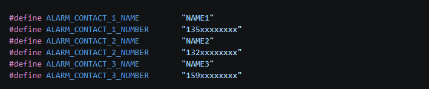

# Emergency Call Alarm

The emergency call alarm solution is an emergency alert and help notification solution built on UniRTOS.

With UniRTOS as the core runtime platform, this project combines button triggering, voice wake-up, SMS notification, and a multi-contact dialing rotation mechanism to perform alarm triggering, contact notification, and emergency help message delivery on the Quectel EG800Z module. The system supports two alarm methods, button triggering and voice wake-up; after the alarm is triggered, an alarm SMS can be sent automatically to all emergency contacts. It also supports configuring multiple emergency contacts: when dialing the first contact fails, the system automatically rotates to the next contact until the notification is completed. Relying on the API-rich UniRTOS, the solution has good cross-module adaptability, making it easy to run on different Quectel modules. It is suitable for scenarios such as portable emergency alarms, elderly care, personal safety protection, and rapid integration with Quectel modules.

# Development Resources

| Accessory Name              | Quantity | Description                                                  | How to Obtain                                                |
| :-------------------------- | :------- | :----------------------------------------------------------- | :----------------------------------------------------------- |
| QuecDuino development board | 1        | Hardware platform for running the project; must carry module model "EG800ZCN_LH/EG800ZEU_LH". | [Buy here](https://www.quecmall.com/goods-detail/2c90800b9e4a2da8019e71fa2b3000df) |
| USB data cable              | 1        | Used to connect the PC and the development board; a USB-A to USB-C cable of the non "charge-only" type. | [Buy here](https://detail.tmall.com/item.htm?ali_refid=a3_430673_1006:1103572855:H:iN3MzxVVXOSPAWKJATalEI8iKmKqJtEV:eb029f7aacc91614af019d5af9cf8eb7&ali_trackid=282_eb029f7aacc91614af019d5af9cf8eb7&id=792907708735&loginBonus=1&mi_id=0000OnGii6VAwboncMLNvxgujyzZSTVWPKVNZ10CzkTIBXU&mm_sceneid=1_0_27850903_0&priceTId=213e09ef17885029529444013e11cc&skuId=6073745560170&spm=a21n57.sem.item.2&utparam={) |
| PC                          | 1        | System: Windows 10/Windows 11.                               | Self-provided                                                |
| SIM card                    | 1        | A USIM card with normal Internet access.                     | Self-provided                                                |
| Speaker                     | 1        | A speaker with power of 2-5 W                                | [Buy here](https://detail.tmall.com/item.htm?ali_refid=a3_430673_1006:1303560141:H:1UEtsEX5o9gEalK6ot+dnA==:8f0dd6b837c4c9e250b45b19b048b111&ali_trackid=282_8f0dd6b837c4c9e250b45b19b048b111&id=656727733940&loginBonus=1&mi_id=0000eFuxxvI3dkbfsjA4nJlHpbZPiU3o9ksXjoYXBm6G9M8&mm_sceneid=1_0_727720075_0&priceTId=2147841b17885034262562164e1108&skuId=4801699341985&spm=a21n57.sem.item.44&utparam={) |
| LED module                  | 1        | GPIO-driven LED module                                       | [Buy here](https://detail.tmall.com/item.htm?ali_refid=a3_430673_1006:1256430174:H:pAYC57K63RlYQ4s95Zvniw==:918898e7fc3244641f0a89ea106df754&ali_trackid=282_918898e7fc3244641f0a89ea106df754&id=610156877546&loginBonus=1&mi_id=0000K58ZmWypAAYEUmAKBBDhtm2IUe2BQse3ugYmODO5XD4&mm_sceneid=1_0_666480043_0&priceTId=2147841b17885035429406683e1108&skuId=5604453201759&spm=a21n57.sem.item.85&utparam={) |
| Buzzer module               | 1        | GPIO-driven buzzer module                                    | [Buy here](https://detail.tmall.com/item.htm?ali_refid=a3_430673_1006:1104520036:H:X/YIdD+/nzZWyWHIKhozj3ahdFvQYGOd:29c4ade72e8b00c896a8a942a601e376&ali_trackid=318_29c4ade72e8b00c896a8a942a601e376&id=21124132861&loginBonus=1&mi_id=0000iZBcipkQ7kz7ND0lyLy7KkYnjLtm7OpOyZ-SZTwo3AQ&mm_sceneid=0_0_28706210_0&priceTId=2147841b17885036012148918e1108&skuId=4319138558993&spm=a21n57.sem.item.127&utparam={) |
| ASRPRO                      | 1        | Optional, used for the voice wake-up feature.                | Self-provided                                                |

# Quick Start

## Hardware Connection


1. Embed the antenna into the antenna base on the development board silkscreened "LTE".
2. Connect the ASRPRO module to UART0 on the development board (RX: Pin38, TX: Pin39); note RX->TX and TX->RX. Datasheet: [Download here](https://www.quectel.com.cn/download/quectel_eg800z系列_quecduino_evb_规格书).
3. The buzzer module can be connected to any GPIO-capable pin (Pin25 by default). GPIO mapping table: [Download here](https://www.quectel.com.cn/download/quectel_eg800z_series_quecopen_gpio_configuration_v1-0-xlsx).
4. The LED module can be connected to any GPIO-capable pin (Pin23 by default), or use the LED on the development board directly. GPIO mapping table: [Download here](https://www.quectel.com.cn/download/quectel_eg800z_series_quecopen_gpio_configuration_v1-0-xlsx).
5. The mechanical button can be connected to any GPIO-capable pin (Pin29 by default), or use the button on the development board directly. GPIO mapping table: [Download here](https://www.quectel.com.cn/download/quectel_eg800z_series_quecopen_gpio_configuration_v1-0-xlsx).
6. Connect the speaker to the two pins on the development board silkscreened "-spk+". For the location, refer to the datasheet: [Download here](https://www.quectel.com.cn/download/quectel_eg800z系列_quecduino_evb_规格书).
7. Connect the development board and the PC with the data cable.

## Software Deployment

### Setting Up the Development Environment

Refer to the [UniRTOS Quick Start](https://docs.quectel.com/zh/UniRTOS/UniRTOS文档/快速上手/快速上手.html) documentation to learn how to set up the development environment and complete the basic development workflow.

### Pulling the Code

Open a new PowerShell window and run the following commands:

```Plain
# Pull the example repository
unirtos-cli new -r unirtos-maker-examples
# Enter the project directory
cd unirtos-maker-examples/alarm_demo
```

### Modifying Configuration Parameters

**Cloud platform configuration parameters**

Configure the cloud platform parameters in *alarm_config.h*. For creating an Alibaba Cloud platform product and obtaining parameters, refer to the [documentation](https://www.quectel.com.cn/unirtos/docs?docs_page=应用开发指南/云平台对接/AliYun平台/AliYun平台.html).


**Contact information configuration**

When contact information has not been delivered from the cloud platform, you can configure temporary contact information in *alarm_config.h*.



### Building the Project

Continue running the environment initialization command in the open PowerShell window:

```PowerShell
unirtos-cli env-setup
```

Run the firmware build command in the PowerShell window (if your module model is not EG800ZCN_LH, replace it with the model you actually need to build):

```PowerShell
unirtos-cli build -m EG800ZCN_LH
```

After the build finishes, the end of the PowerShell window will show the firmware build result:

```Plain
SUCCESS: Unirtos project built successfully!
```

After the firmware builds successfully, flash it to the development board with QFlash.