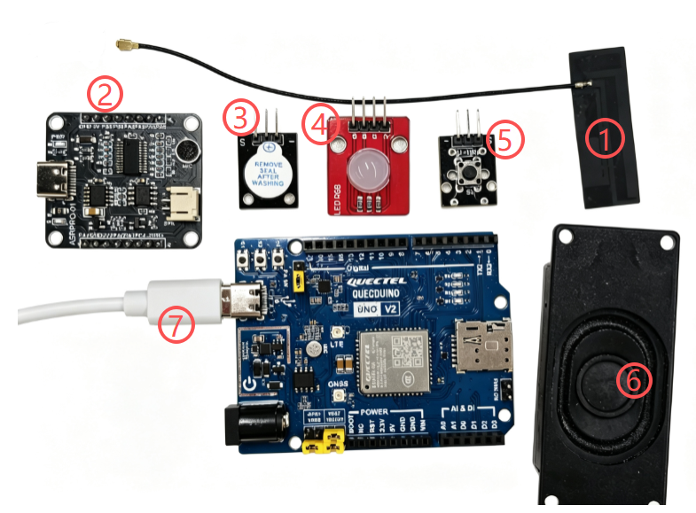
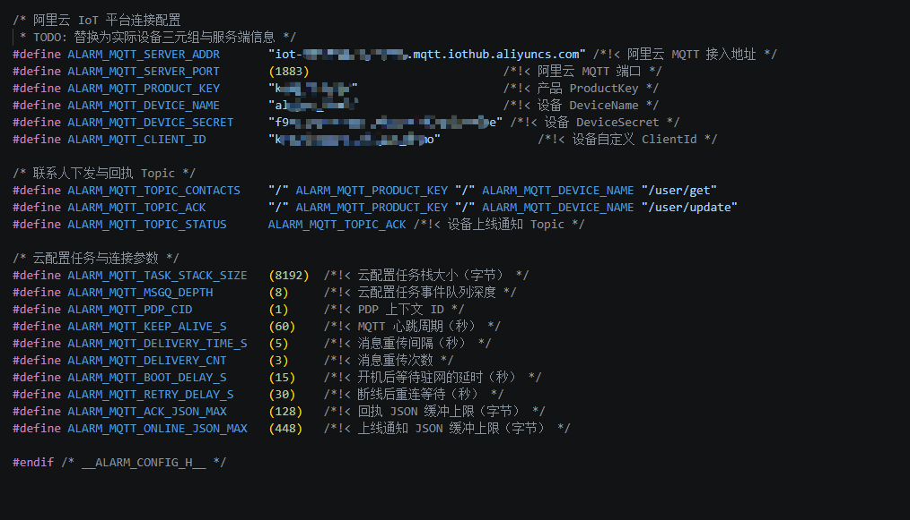
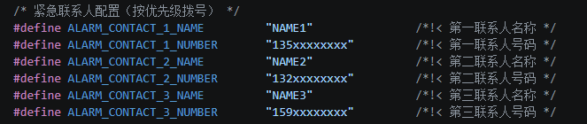
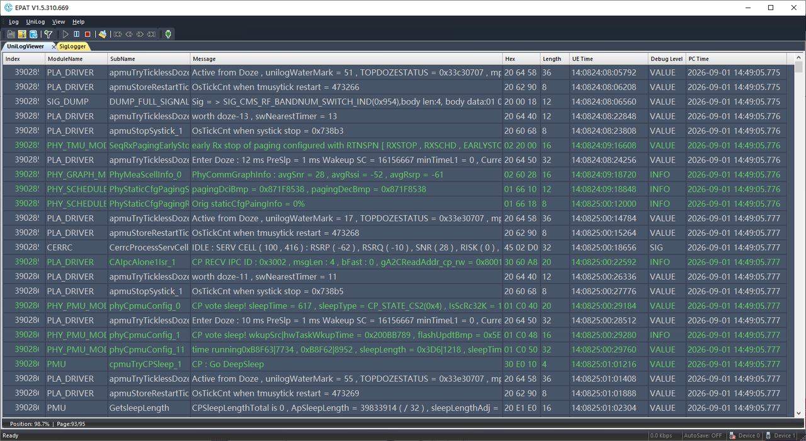
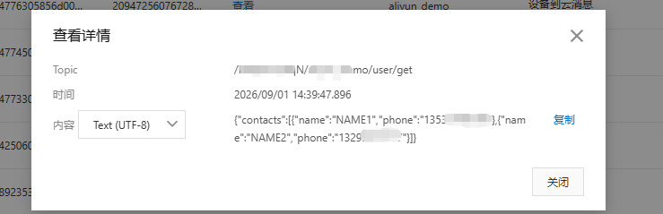
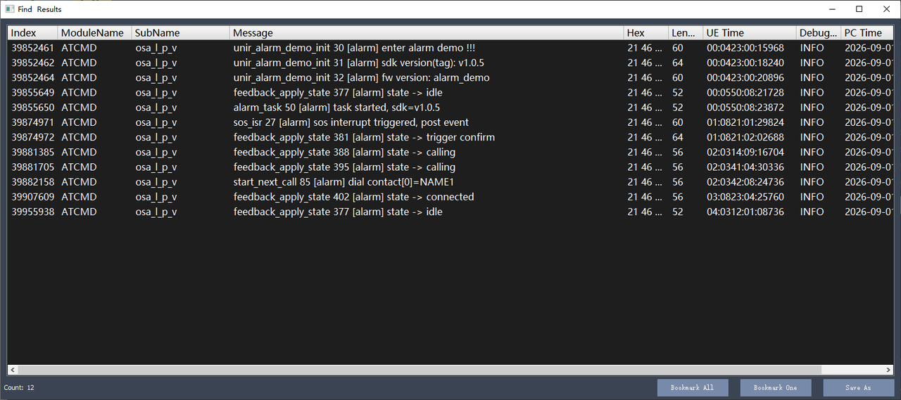

# 紧急呼叫报警器

紧急报警器方案是一个基于UniRTOS构建的紧急报警与求助通知方案。

本项目以UniRTOS作为核心运行平台，结合按键触发、语音唤醒、短信通知和多联系人拨号轮询机制，在移远EG800Z模组上完成报警触发、联系人通知与紧急求助信息发送。系统支持按键触发和语音唤醒两种报警方式，报警后可自动向所有紧急联系人发送报警短信；同时支持配置多紧急联系人，当第一联系人电话拨号失败时，可自动轮询下一联系人，直至完成通知。依托API接口丰富的UniRTOS，方案具备良好的跨模组适配能力，便于在不同移远模组上运行，适用于便携应急报警、老人看护、个人安全防护及移远模组快速集成等场景。

## 开发资源

| 配件名称        | 数量 | 简要描述                                                    | 获取方法                                                     |
| :-------------- | :--- | :---------------------------------------------------------- | :----------------------------------------------------------- |
| QuecDuino开发板 | 1    | 项目运行硬件平台，需搭载模块型号“EG800ZCN_LH/EG800ZEU_LH”。 | [点此购买](https://www.quecmall.com/goods-detail/2c90800b9e4a2da8019e71fa2b3000df) |
| USB数据线       | 1    | 用于连接PC和开发板，非“仅充电”类型USB-A转USB-C。            | [点此购买](https://detail.tmall.com/item.htm?ali_refid=a3_430673_1006%3A1103572855%3AH%3AiN3MzxVVXOSPAWKJATalEI8iKmKqJtEV%3Aeb029f7aacc91614af019d5af9cf8eb7&ali_trackid=282_eb029f7aacc91614af019d5af9cf8eb7&id=792907708735&loginBonus=1&mi_id=0000OnGii6VAwboncMLNvxgujyzZSTVWPKVNZ10CzkTIBXU&mm_sceneid=1_0_27850903_0&priceTId=213e09ef17885029529444013e11cc&skuId=6073745560170&spm=a21n57.sem.item.2&utparam={"aplus_abtest"%3A"80d921898feda47009cd32ee6352cefe"}&xxc=ad_ztc) |
| PC              | 1    | 系统为Windows 10/Windows 11。                               | 自行准备                                                     |
| SIM卡           | 1    | 可正常上网的USIM卡。                                        | 自行准备                                                     |
| 喇叭            | 1    | 功率 2-5 W的喇叭                                            | [点此购买](https://detail.tmall.com/item.htm?ali_refid=a3_430673_1006%3A1303560141%3AH%3A1UEtsEX5o9gEalK6ot%2BdnA%3D%3D%3A8f0dd6b837c4c9e250b45b19b048b111&ali_trackid=282_8f0dd6b837c4c9e250b45b19b048b111&id=656727733940&loginBonus=1&mi_id=0000eFuxxvI3dkbfsjA4nJlHpbZPiU3o9ksXjoYXBm6G9M8&mm_sceneid=1_0_727720075_0&priceTId=2147841b17885034262562164e1108&skuId=4801699341985&spm=a21n57.sem.item.44&utparam={"aplus_abtest"%3A"1b6a8702424a77081a5003ca3ca2d9e9"}&xxc=ad_ztc) |
| LED模块         | 1    | GPIO驱动的LED模块                                           | [点此购买](https://detail.tmall.com/item.htm?ali_refid=a3_430673_1006%3A1256430174%3AH%3ApAYC57K63RlYQ4s95Zvniw%3D%3D%3A918898e7fc3244641f0a89ea106df754&ali_trackid=282_918898e7fc3244641f0a89ea106df754&id=610156877546&loginBonus=1&mi_id=0000K58ZmWypAAYEUmAKBBDhtm2IUe2BQse3ugYmODO5XD4&mm_sceneid=1_0_666480043_0&priceTId=2147841b17885035429406683e1108&skuId=5604453201759&spm=a21n57.sem.item.85&utparam={"aplus_abtest"%3A"52f1fc6574a371d5d0c10acc0eb02cbe"}&xxc=ad_ztc) |
| 蜂鸣器模块      | 1    | GPIO驱动的蜂鸣器模块                                        | [点此购买](https://detail.tmall.com/item.htm?ali_refid=a3_430673_1006%3A1104520036%3AH%3AX%2FYIdD%2B%2FnzZWyWHIKhozj3ahdFvQYGOd%3A29c4ade72e8b00c896a8a942a601e376&ali_trackid=318_29c4ade72e8b00c896a8a942a601e376&id=21124132861&loginBonus=1&mi_id=0000iZBcipkQ7kz7ND0lyLy7KkYnjLtm7OpOyZ-SZTwo3AQ&mm_sceneid=0_0_28706210_0&priceTId=2147841b17885036012148918e1108&skuId=4319138558993&spm=a21n57.sem.item.127&utparam={"aplus_abtest"%3A"8e8e36af0b9e6b0c2143d14dbd854c3a"}&xxc=ad_ztc) |

## 快速上手

### 硬件连接



1. 将天线嵌入开发板丝印为“LTE”的天线底座。
2. ASRPRO模块连接开发板UART0（RX：Pin38，TX：Pin39），注意RX->TX、TX->RX。规格书：[点此获取](https://www.quectel.com.cn/download/quectel_eg800z系列_quecduino_evb_规格书)。
3. 蜂鸣器模块可连接任意支持GPIO的引脚（默认Pin25）。GPIO映射表：[点此获取](https://www.quectel.com.cn/download/quectel_eg800z_series_quecopen_gpio_configuration_v1-0-xlsx)。
4. LED模块可连接任意支持GPIO的引脚（默认Pin23）。或直接使用开发板上的LED。GPIO映射表：[点此获取](https://www.quectel.com.cn/download/quectel_eg800z_series_quecopen_gpio_configuration_v1-0-xlsx)。
5. 机械按键可连接任意支持GPIO的引脚（默认Pin29），或直接使用开发板上的按键。GPIO映射表：[点此获取](https://www.quectel.com.cn/download/quectel_eg800z_series_quecopen_gpio_configuration_v1-0-xlsx)。
6. 喇叭连接开发板丝印为“-spk+”的两个引脚。位置可参照规格书：[点此获取](https://www.quectel.com.cn/download/quectel_eg800z系列_quecduino_evb_规格书)。
7. 使用数据线连接开发板和电脑。

## 软件部署

### 开发环境搭建

参考[UniRTOS快速入门](https://docs.quectel.com/zh/UniRTOS/UniRTOS文档/快速上手/快速上手.html)文档，了解如何搭建开发环境并完成基本开发流程。

### 代码拉取

新开启一个PowerShell窗口，执行以下命令：

```Plain
# 拉取示例仓库
unirtos-cli new -r unirtos-maker-examples
# 进入该项目
cd unirtos-maker-examples/alarm_demo
```

### 修改配置参数

**云平台配置参数**

在*alarm_config.h*中配置云平台相关参数。关于阿里云平台产品创建与参数获取，可参考[文档](https://www.quectel.com.cn/unirtos/docs?docs_page=应用开发指南/云平台对接/AliYun平台/AliYun平台.html)说明。



**联系人信息配置**

云平台未下发联系人信息时，可在*alarm_config.h*中配置临时使用的联系人信息。



### 构建项目

在开启的PowerShell窗口继续执行环境初始化命令：

```PowerShell
unirtos-cli env-setup
```

在PowerShell窗口执行固件编译命令（如使用模块型号非EG800ZCN_LH，请替换实际需要编译的型号）：

```PowerShell
unirtos-cli build -m EG800ZCN_LH -v EG800ZCN_LH_BETA_20260904
```

等待编译结束后，PowerShell窗口末尾会提示固件编译结果：

```Plain
SUCCESS: Unirtos project built successfully!
```

固件编译成功后通过QFlash烧录到开发板中。

### 板上验证

1. 长按开发板电源键（S1）开机，打开EPAT工具，根据[教程](https://www.quectel.com.cn/unirtos/docs?docs_page=快速上手/日志调试/日志调试.html)进行配置，配置完成后重启开发板，从模组上电开始抓取模组日志，确保日志输出完整。



1. 在云平台下发实际需要的JSON格式的联系人信息，**重启开发板以应用新的联系人信息**。格式参考：

```JSON
{"contacts":[{"name":"NAME1","phone":"135xxxxxxxx"},{"name":"NAME2","phone":"132xxxxxxxxx"}]} 
```



1. 按下按键或语音唤醒（唤醒词默认为“救命”）触发报警，可组合多种情况进行测试，如第一联系人接通/失败，第二联系人接通/失败等，测试完成后，在EPAT搜索“[alarm]”查看运行日志。



## 效果说明

项目在三种状态下的现象如下：

- 空闲：LED模块呼吸灯效果，蜂鸣器关闭。
- 拨号中：报警触发直至接通阶段，LED快速闪烁，蜂鸣器开启。
- 通话中：电话接通状态下，LED和蜂鸣器均关闭。

报警触发和所有联系人拨号失败两种情况下，会有TTS播报提醒。